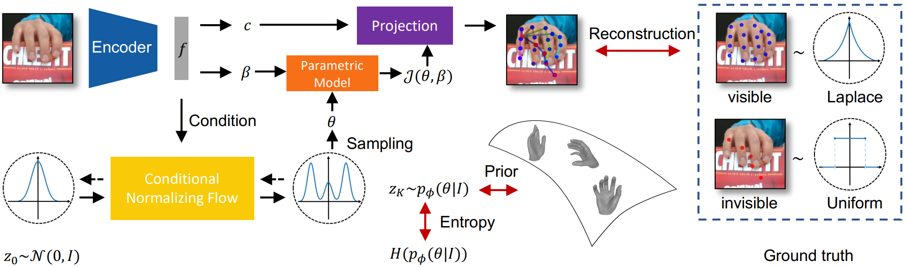
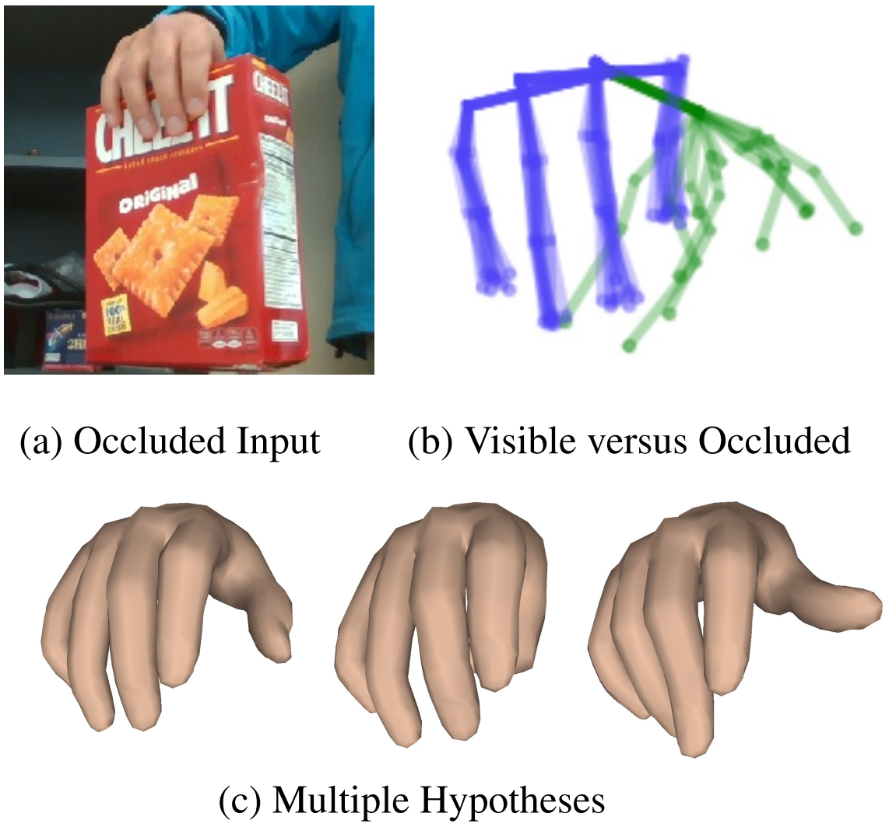
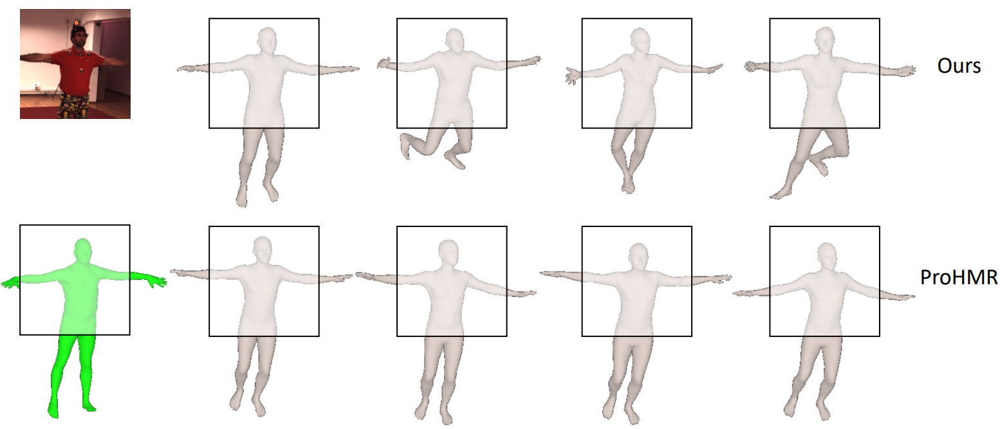

# The Official PyTorch Implementation of "MHEntropy: Multiple Hypotheses Meet Entropy for Pose and Shape Recovery" [(ICCV 2023 Paper)]()

Rongyu Chen*, Linlin Yang*, and Angela Yao†<br>
ICCV 2023<br>
paper | [website](https://gloryyrolg.github.io/MHEntropy/)

Thanks for your interests.

[]()

## Hands

[]()

Please find the hand experiments [here](https://github.com/GloryyrolG/MHEntropy/blob/master/hand/README.md).

## Humans

[]()

Our method can be adapted to a variety of backbone models. Simply use the ProHMR code repo to load our [pre-trained model weights](https://drive.google.com/file/d/19gaxHvpTB5f6ojYECSc8uXXdLtghTxGC/view?usp=sharing) to performa inference and evaluation.

## Bibtex:
Please cite our paper, if you happen to use this codebase:

```
@inproceedings{chen2023MHEntropy,
  title={{MHEntropy}: Multiple Hypotheses Meet Entropy for Pose and Shape Recovery},
  author={Chen, Rongyu and Yang, Linlin and Yao, Angela},
  booktitle={Proceedings of the IEEE/CVF International Conference on Computer Vision (ICCV)},
  year={2023}
}
```